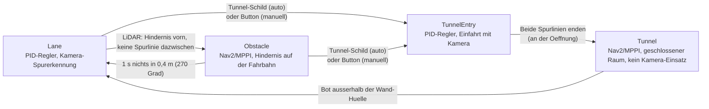
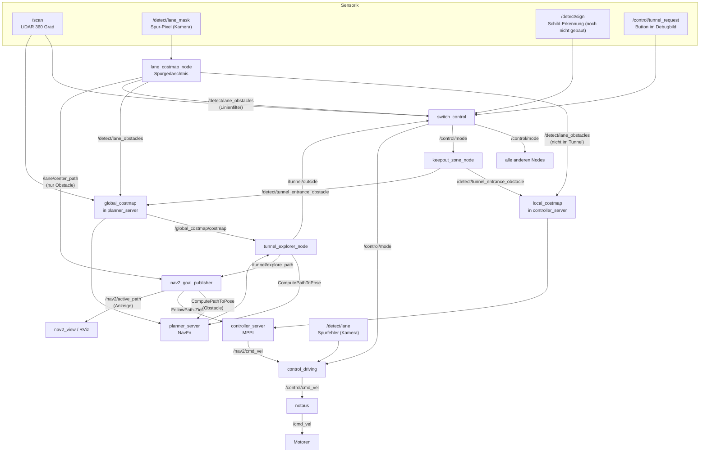
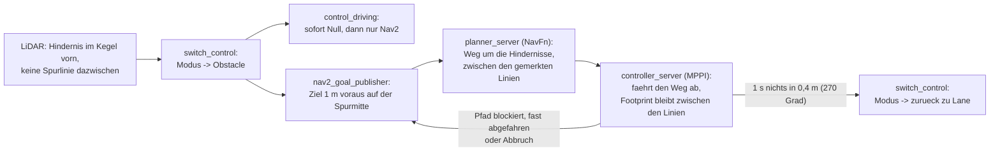

# Nav2-Fahrmodi: Hindernisvermeidung & Tunnel-Navigation

Dokumentation für alle, die nicht direkt am Code gearbeitet haben, aber verstehen wollen/müssen, wie die Nav2-Fahrmodi funktionieren und welche Werte am Wettbewerbstag ggf. angepasst werden müssen.

---

## 1. Worum geht's

Neben der PID-Spurregelung (`Lane`-Modus) haben wir eine zweite, parallele Fahr-Pipeline auf Basis von **Nav2** (dem Standard-Navigationsframework von ROS2) gebaut. Diese eine Pipeline deckt **zwei unterschiedliche Situationen** ab, die sich beide Infrastruktur teilen (dieselbe Costmap, derselbe MPPI-Regler, derselbe Übergabe-Node), sich aber in ihrem Zweck unterscheiden:

- **Obstacle-Modus:** liegt im Hindernisbereich außerhalb des Tunnels ein Hindernis in der per Kamera erkannten Fahrbahn, übernimmt Nav2 kurzzeitig, weicht aus und bleibt dabei zwischen den Spurlinien. Läuft automatisch, ohne Zeitdruck, mitten im normalen Rennen.
- **Tunnel-Modus:** eigener Streckenabschnitt (im Reglement „Enclosure“), ausgelöst per Schild oder per Button im Debugbild: der Roboter fährt in einen geschlossenen Raum mit Hindernissen, muss ihnen ausweichen und **innerhalb eines Zeitlimits** einen Ausgang finden — aber nicht den, durch den er reingefahren ist. **Die Kamera ist dort laut Reglement verboten**, es zählt nur der LiDAR.

Beide Modi laufen über dieselben Nodes, aktivieren sich aber unabhängig voneinander und nutzen teils unterschiedliche Zusatz-Nodes (siehe Abschnitt 3/4). Die Pipeline läuft die ganze Zeit mit, wird aber nur aktiv, wenn der Roboter tatsächlich im Obstacle- oder Tunnel-Modus ist.

---

## 2. Die drei Fahrmodi

Ein einziger Node (`switch_control`) entscheidet, welcher der folgenden Modi gerade aktiv ist, und alle anderen Nodes richten sich danach:

```mermaid
flowchart LR
    Lane["Lane\nPID-Regler, Kamera-Spurerkennung"]
    Obstacle["Obstacle\nNav2/MPPI, Hindernis auf der Fahrbahn"]
    Tunnel["Tunnel\nNav2/MPPI, geschlossener Raum, kein Kamera-Einsatz"]

    Lane -- "LiDAR: Hindernis vorn, keine Spurlinie dazwischen" --> Obstacle
    Obstacle -- "1 s nichts in 0,4 m (270 Grad)" --> Lane
    TunnelEntry["TunnelEntry\nPID-Regler, Einfahrt mit Kamera"]
    Lane -- "Tunnel-Schild (auto)\noder Button (manuell)" --> TunnelEntry
    Obstacle -- "Tunnel-Schild (auto)\noder Button (manuell)" --> TunnelEntry
    TunnelEntry -- "Beide Spurlinien enden\n(an der Oeffnung)" --> Tunnel
    Tunnel -- "Bot ausserhalb der Wand-Huelle" --> Lane
```

- **Lane**: der normale Betrieb, PID-Regler folgt der Spur.
- **Obstacle**: sobald der LiDAR etwas direkt vor dem Roboter erkennt und zwischen Roboter und Objekt keine Spurlinie liegt, übernimmt Nav2, plant einen Weg darum herum und fährt ihn ab — automatisch, ohne Schild. Objekte auf der anderen Seite einer Spurlinie (z. B. Hindernisse neben dem Rückweg) lösen nichts aus. Zurück zu Lane geht es, wenn 1 s lang im Umkreis von 0,4 m nichts liegt, gemessen nach vorn, zur Seite und schräg nach hinten (270°). Der Keil direkt hinter dem Bot zählt nicht, von dort kam er gerade. Mit `obstacle_enabled` = false (Taste O im Not-Aus, Häkchen in rqt, Standard bei `follow_lane.sh`) gibt es keinen Wechsel nach Obstacle, ein laufendes Obstacle endet sofort.
- **TunnelEntry**: Einfahrt. Der Bot folgt wie im Lane-Modus mit dem PID der Spur; auf der 20-cm-Spur passt er für Nav2 nicht zwischen die Spurwände. Die Kamera ist hier noch erlaubt. Die Linien reichen nur bis zur Öffnung: Fehlen beide in 5 Bildern in Folge in der Suchzeile (oder kommt 1 s gar kein Bild), schaltet `switch_control` auf `Tunnel`. Es gibt keinen Abstands- oder Breitenwert.
- **Tunnel**: eigener Modus für den geschlossenen Raum, ohne Kamera. Beim Umschalten wird das Spurgedächtnis verworfen, eine leere Spurwolke gesendet und 0,3 s später werden beide Karten geleert; die Tunnelkarte bleibt bis zum Austritt. `tunnel_explorer_node` findet die Tür im Scan, fährt hindurch und sucht den Ausgang (Abschnitt 7). Zurück geht es, wenn der ganze Bot außerhalb der Wand-Hülle ist und vorher einmal drin war. Stand beim Umschalten keine Linie im Bild, ist er schon im Eingang oder im Tunnel: Die Einfahrt entfällt. Ohne TunnelEntry davor (Start im Tunnel) gibt es keine Eingangssperre. Taste L im Tunnel setzt Sperre und Explorer an der aktuellen Pose neu auf. Ausgelöst wird der Tunnel auf zwei Wegen:
  - **Schild:** ein Erkennungsmodell sendet `6` (`std_msgs/UInt8`) auf `/detect/sign`. Auf diesem Branch gibt es noch keinen Sender. Die Schildnummern stehen in `SignType` (`common.py`), getrennt von den Modusnummern; welcher Modus aus einem Schild folgt, entscheidet `switch_control`.
  - **Button „TUNNEL STARTEN“ im Debugbild:** um die Challenge einzeln zu fahren. Der Bot steht dabei vor der Öffnung. In TunnelEntry und Tunnel wird daraus „TUNNEL ABBRECHEN“. Nach dem automatischen Austritt springt der Button von selbst zurück.

  Wer ausgelöst hat, steht im Debugbild unter dem Modus: „(manuell)“ oder „(auto)“, auch auf `/control/tunnel_source`.

`switch_control` merkt sich beim Eintritt in den Tunnel, welcher Modus vorher aktiv war, und stellt genau den beim Verlassen wieder her (nicht stur "zurück zu Lane"). Jeder Moduswechsel wird sofort auf `/control/mode` gesendet, zusätzlich alle 0,5 s.

Die Werte `Stop`, `Intersection` und `Align` gibt es im Enum schon, sie haben aber noch keinen Auslöser (vorgesehen für Schranke und Kreuzung an Tag 1). In diesen Modi sendet `control_driving` Null.

### Wer fährt, wer nutzt die Kamera?

Fahrbefehle erzeugt nur `control_driving`. Er wählt je nach Modus die Quelle und sendet auf `/control/cmd_vel`; der Not-Aus (`notaus`) reicht das nach Freigabe an `/cmd_vel` durch.

| | **Lane-Modus** | **Obstacle-Modus** | **Tunnel-Modus** |
|---|---|---|---|
| Quelle in `control_driving` | PID auf `/detect/lane` | `/nav2/cmd_vel` (MPPI), auf Radgrenze skaliert | `/nav2/cmd_vel` (MPPI), auf Radgrenze skaliert |
| Wer nutzt die Kamera? | `control_driving` über `/detect/lane`; `lane_costmap_node` für die Spurwände | `lane_costmap_node` für die Spurwände | niemand: `ingress_node` und `detect_lane` pausieren (Reglement) |
| Was steht in local_ und global_costmap? | LiDAR + Spurgedächtnis | LiDAR + Spurgedächtnis | LiDAR + Eingangssperre |
| Wird geplant? | nein, nichts geplant und nichts angezeigt | ja: NavFn plant bei Bedarf einen Weg um die Hindernisse, MPPI fährt ihn ab | ja: Explorer + NavFn |

**Wie die Spurwände ohne bekannte Breite funktionieren:** Die Breite des Hindernisbereichs kennen wir erst am Wettbewerbstag. Deshalb hängt kein Wert davon ab. MPPI prüft Kollisionen mit dem echten Umriss des Burger (138 × 178 mm, `footprint` in `nav2_params.yaml`). Eine Fahrbewegung ist verboten, sobald der Umriss eine Linie oder ein Hindernis berührt, und erlaubt, wenn er dazwischen passt. Die Inflation um die Linien ist nur ein Kostengefälle, das zur Mitte zieht. Details: `docs/Nav2_Costmap_Werte.md`, Abschnitt 3.

Weil nur `control_driving` auf `/control/cmd_vel` sendet, konkurrieren nie zwei Regler. Ist die aktive Quelle veraltet (PID: 0,3 s ohne `/detect/lane`, Nav2: 0,25 s ohne `/nav2/cmd_vel`) oder kommt 1,5 s kein `/control/mode`, sendet er Null. Bei jedem Moduswechsel sendet er sofort Null und nimmt nur Befehle an, die danach eintreffen. Nach dem Wechsel in den Tunnel ignoriert er Nav2 zusätzlich 0,3 s lang, bis das alte Obstacle-Ziel (Spurmitte, also Kameradaten) abgebrochen ist.

---

## 3. Gesamtarchitektur

```mermaid
flowchart TB
    subgraph Sensorik
        SCAN["/scan\nLiDAR 360 Grad"]
        LANE["/detect/lane_mask\nSpur-Pixel (Kamera)"]
        SIGN["/detect/sign\nSchild-Erkennung (noch nicht gebaut)"]
        BTN["/control/tunnel_request\nButton im Debugbild"]
    end

    SCAN --> SC[switch_control]
    SIGN --> SC
    BTN --> SC
    SC -->|"/control/mode"| ALL[alle anderen Nodes]

    LANE --> LCM[lane_costmap_node\nSpurgedaechtnis]
    LCM -->|"/detect/lane_obstacles\n(nicht im Tunnel)"| LC[local_costmap\nin controller_server]
    LCM -->|"/detect/lane_obstacles"| GC[global_costmap\nin planner_server]
    LCM -->|"/detect/lane_obstacles\n(Linienfilter)"| SC
    LCM -->|"/lane/center_path\n(nur Obstacle)"| GP

    SC -->|"/control/mode"| KZ[keepout_zone_node]
    KZ -->|"/detect/tunnel_entrance_obstacle"| LC
    KZ -->|"/detect/tunnel_entrance_obstacle"| GC
    TE[tunnel_explorer_node] -->|"/tunnel/outside"| SC
    SCAN --> GC

    GC -->|"/global_costmap/costmap"| TE
    TE -->|"ComputePathToPose"| PS[planner_server\nNavFn]
    PS --> TE
    TE -->|"/tunnel/explore_path"| GP[nav2_goal_publisher]
    GP -->|"ComputePathToPose\n(Obstacle)"| PS
    GC --> PS

    GP -->|"FollowPath-Ziel"| CS[controller_server\nMPPI]
    GP -->|"/nav2/active_path\n(Anzeige)"| VIEW[nav2_view / RViz]
    LC --> CS
    CS -->|"/nav2/cmd_vel"| CD[control_driving]
    DL["/detect/lane\nSpurfehler (Kamera)"] --> CD
    SC -->|"/control/mode"| CD
    CD -->|"/control/cmd_vel"| NA[notaus]
    NA -->|"/cmd_vel"| MOT[Motoren]
```

Wichtig zum Verständnis: **`lane_costmap_node` sendet die Spurwände in jedem Modus außer Tunnel, die Spurmitte nur in Obstacle. Beim Wechsel auf Tunnel verwirft er das Gedächtnis, sendet eine leere Wolke und leert 0,3 s später beide Costmaps. `nav2_goal_publisher` plant nur in Obstacle und Tunnel. `keepout_zone_node` und `tunnel_explorer_node` arbeiten nur im Tunnel-Modus.** Außerhalb ihres jeweiligen Modus veröffentlichen sie nichts.

---

## 4. Die Nodes im Einzelnen

### `switch_control` — die Zustandsmaschine
Entscheidet, welcher Modus aktiv ist (siehe Abschnitt 2), und veröffentlicht das laufend auf `/control/mode`. Alle anderen Nodes lesen nur mit, niemand sonst darf diesen Wert verändern. Für Eintritt und Austritt des Obstacle-Modus prüft er jeden LiDAR-Punkt gegen das Spurgedächtnis (`/detect/lane_obstacles`): Liegt auf der Strecke Bot → Punkt eine Spurlinie, gehört der Punkt nicht zur eigenen Fahrbahn und zählt nicht. Ist das Gedächtnis älter als `LANE_MAX_AGE_S`, zählt jeder Punkt. Den Tunnel-Wunsch des Buttons bekommt er auf `/control/tunnel_request` (`True` = Start, `False` = Abbruch), den Auslöser meldet er auf `/control/tunnel_source` (`manuell`, `auto` oder leer). `obstacle_enabled` (Taste O) schaltet den Obstacle-Modus ab.

### `control_driving` — die einzige Quelle für Fahrbefehle
Wählt je nach `/control/mode` den PID (Lane, TunnelEntry) oder reicht `/nav2/cmd_vel` durch (Obstacle, Tunnel); in jedem anderen Modus Null. Würde das äußere Rad schneller als 0,22 m/s (`MAX_WHEEL_VEL`), skaliert es v und ω gemeinsam herunter, die Bahn bleibt gleich. Die MPPI-Grenzen (`vx_max`, `wz_max`) stehen in `nav2_params.yaml`. Zeitgrenzen und Verhalten beim Moduswechsel siehe Abschnitt 2.

### `notaus` — die Fahrfreigabe
Letzte Stufe zwischen `/control/cmd_vel` und `/cmd_vel`. Erzeugt keine Bewegung, reicht nur nach Freigabe (Leertaste, rqt `drive`, `/notaus/set`) durch oder sendet Null, auch wenn 0,5 s (`cmd_timeout_s`) nichts kommt. Taste L sendet `/control/clear_maps` (Spurgedächtnis und Costmaps leeren, im Tunnel Neustart der Einfahrt), Taste O schaltet `obstacle_enabled` von `switch_control` um.

### `debug_view` — das Debugbild mit Tunnel-Button
Zeichnet das Debugbild auf `/lokal/debug_view`, angezeigt in `rqt_image_view`. Im Tunnel steht statt des Kamerabilds ein Platzhalter. Unten im Mode-Panel liegt der Tunnel-Button. Ein Klick darauf kommt als Klickposition von `rqt_image_view` auf `/lokal/debug_view_mouse_left` an. Dafür muss in `rqt_image_view` einmal die Checkbox **„Publish click location“** angehakt sein.

### `lane_costmap_node` — das Spurgedächtnis (nicht im Tunnel)
Wandelt die von der Kamera erkannten Spurlinien-Pixel aus der metrischen Vogelperspektive `/lokal/bev` über `Parameter/bev.yaml` in Meter um. Wand werden nur die gelbe und die weiße Spurlinie: Jede wird vom bot-nahen Ende aus verfolgt (auch durch enge Kurven), nur Pixel bis `line_margin` um ihre Mitte zählen. Querlinien, Papier und helle Flächen neben der Strecke werden so keine Wand; knickt eine Linie gegen die andere ab (Querlinie in L-Form), endet sie dort. Pixel am Hindernis und in seinem LiDAR-Schatten fallen vorher weg, weil die BEV hohe helle Gegenstände lang zieht. Diese Linien merkt er sich in einem ortsfesten Raster (odom-Frame, 1 cm). Eine Zelle wird erst nach `line_confirm_frames` (3) Bildern in Folge zur Linie und erst nach `free_confirm_frames` (10) Bildern in Folge ohne Linie wieder frei. Abgestimmt wird nur, was die Kamera gerade sieht (Sichtmaske `/lokal/bev_view` von `ingress_node`); Zellen im Sichtschatten eines LiDAR-Hindernisses bekommen keine „frei“-Stimme, weil das Hindernis die Linie dort nur verdeckt. So kennt Nav2 auch Linien neben und hinter dem Bot, die die Kamera (5–60 cm voraus) nicht mehr sieht.

Gesendet wird jedes Mal das ganze Gedächtnis im Umkreis von 2 m auf `/detect/lane_obstacles` — an die `lane_layer` beider Costmaps und an `switch_control`. Sendet auch im Lane-Modus, damit der Korridor beim Umschalten schon in der Karte steht. Die Spurmitte (`/lane/center_path`, mit laufend gemessener Spurbreite) sendet er nur im Obstacle-Modus. Im Tunnel sendet er nur beim Eintritt eine leere Wolke, verwirft das Gedächtnis und leert 0,3 s später beide Costmaps. Dasselbe passiert in jedem Modus auf `/control/clear_maps` (Taste L), wenn die Karten nicht mehr zur Odometrie passen. Die Eingangssperre bleibt dabei stehen.

### `nav2_view` — die Draufsicht mit Statuszeile
Zeichnet auf `/nav2/view` ein Bild davon, was Nav2 sieht und plant: im Tunnel die `global_costmap`, sonst die `local_costmap` mit den Spurwänden. Grün ist befahrbar (dunkler = nah am Hindernis), rot blockiert, grau unbekannt, gelb/weiß die erkannten Spurlinien (`/detect/lane_mask`). Blau der Umriss des Bots (`/local_costmap/published_footprint`) mit Fahrtrichtung (magenta), cyan der Pfad, dem Nav2 gerade folgt (`/nav2/active_path`), mit Ziel (X) — nur während einer Fahrt, im Lane-Modus nie, orange die Eingangssperre, hellblau die LiDAR-Punkte. Unten eine Legende. Die Ausrichtung ist fest (odom-X nach rechts), sodass Wände stillstehen und nur der Bot sich bewegt.

Oben steht die Statuszeile: Modus und Auslöser, was `nav2_goal_publisher` gerade tut (`/nav2/status`, z. B. „faehrt: Bahnplaner (Spurmitte)“ oder „kein Weg gefunden“), und darunter die letzte Warnung bzw. der letzte Fehler der Nav2-Knoten aus `/rosout`, zum Beispiel „controller_server: Failed to make progress“. Das ist der Abbruchgrund: Das FollowPath-Ergebnis meldet in Humble nur „abgebrochen“, den Grund schreibt `controller_server` nur ins Log. Rot heißt jünger als 10 s.

Gezeigt wird ein Ausschnitt: außerhalb des Tunnels ein Quadrat von `LOCAL_VIEW_SIZE_M` (2,4 m) um den Bot. Das deckt die MPPI-Vorausschau (~1 m) mit Rand ab. Im Tunnel werden keine Spurlinien gezeichnet. Es ist zentriert, damit das Bild beim Lenken nicht springt. Im Tunnel ist es nur die schon gesehene Fläche plus `TUNNEL_VIEW_MARGIN_M` (0,3 m), sodass das Bild mit der Karte herauszoomt.

`nav2_obstacle` öffnet dafür ein zweites `rqt_image_view`-Fenster.

### `keepout_zone_node` — die Eingangs-Sperrzone (nur Tunnel-Modus)
Setzt beim Wechsel TunnelEntry → Tunnel eine virtuelle Wand quer zur Fahrtrichtung durch die Radachse, 40 cm lang, ortsfest im odom-Frame, damit der Roboter nicht durch den Eingang wieder hinausfährt. Sie erscheint erst, wenn der Bot 16 cm weiter ist, sonst stünde er in ihr. Ohne TunnelEntry davor (Start im Tunnel) gibt es keine Wand; Taste L legt sie an der aktuellen Pose neu. Der Node hat keine Parameter.

### `tunnel_explorer_node` — die Ausgangssuche (nur Tunnel-Modus)
Fährt zuerst durch die Tür und sucht danach den Ausgang, siehe Abschnitt 7. Meldet auf `/tunnel/outside`, wenn der Bot draußen ist. Im Tunnel stellt er den Regler langsamer und den Fortschritts-Check lockerer (`TUNNEL_CONTROLLER`: `vx_max` 0,10 m/s, 0,05 m in 6 s). Der Node hat keine Parameter: Alle Grenzen hängen am Bot oder an der Karte (`tunnel_geometry.py`).

### `nav2_goal_publisher` — der Übergeber
Schickt das eigentliche Fahrkommando an Nav2. Im Obstacle-Modus setzt er ein Ziel `goal_distance` (1 m) voraus auf der Spurmitte von `lane_costmap_node` (über ihr Ende hinaus in ihrer Richtung verlängert; ohne aktuelle Spurmitte geradeaus), lässt `planner_server` einen Weg dorthin um die Hindernisse rechnen und gibt ihn `controller_server`. Neu geplant wird nur bei Bedarf: wenn eine gesperrte Zelle auf dem Pfad liegt, wenn er bis auf `goal_distance`/2 abgefahren ist oder wenn die Fahrt endet. Kein Takt, sonst springen die Wege. Im Tunnel-Modus nimmt er den Pfad, den `tunnel_explorer_node` geliefert hat. Den Pfad, dem Nav2 gerade folgt, veröffentlicht er auf `/nav2/active_path`; beim Verlassen des Modus leert er ihn. Im Lane-Modus ruht er.

### `controller_server` (Nav2, MPPI) — die eigentliche Fahrsteuerung
Nav2-Standardkomponente, nicht selbst geschrieben. Nimmt den Pfad entgegen und berechnet daraus in Echtzeit die tatsächlichen Fahrbefehle (auf `/nav2/cmd_vel`). Vor MPPI sitzt ein RotationShim: Weicht der Pfad mehr als 45° ab, dreht er den Bot auf der Stelle. MPPI prüft mit dem echten Umriss gegen die `local_costmap` und weicht lokal ab, wo der Pfad zu eng ist.

### `planner_server` (Nav2, NavFn) — der Bahnplaner (Obstacle und Tunnel)
Nav2-Standardkomponente. Berechnet auf der `global_costmap` (LiDAR + Spurgedächtnis, im Tunnel LiDAR + Eingangssperre) einen Weg zu einem Zielpunkt: im Obstacle-Modus auf Anfrage von `nav2_goal_publisher` um die Hindernisse herum, im Tunnel auf Anfrage von `tunnel_explorer_node`. Immer **nur durch bereits bekanntes, freies Gebiet** (siehe Abschnitt 7). NavFn plant für einen Kreis (`robot_radius` 0,09 m plus Polster: Saum 0,098 m um jedes Hindernis), nicht für den echten Umriss. Lücken ab etwa 0,20 m sind planbar.

---

## 5. Parameter-Referenz — was anpassen, was bedeutet es

In den YAMLs steht nur, was man vor Ort einstellt. Diese Parameter haben keinen Code-Default: Fehlt ein Wert, stoppt der Node mit klarer Meldung. Namen in GROSSBUCHSTABEN sind feste Konstanten im Code des Nodes.

### 5.1 `switch_control.py` → Datei `Switch_Control.yaml`

| Parameter | Wert (YAML) | Bedeutung | Auswirkung |
|---|---|---|---|
| `obstacle_check_angle_deg` | 45.0° | **Halb**winkel des Prüfkegels nach vorne (Gesamtkegel 90°), in dem nach Hindernissen gesucht wird | Größer = reagiert auch auf seitlichere Objekte |
| `obstacle_trigger_distance` | 0.30 m | Ab welcher Nähe (ab LiDAR) gilt "da ist ein Hindernis" | Größer = reagiert früher, Nav2 hat mehr Platz |
| `OBSTACLE_CLEAR_ANGLE_DEG` | 135° | **Halb**winkel des Austrittsbereichs (270°, ohne den Keil direkt hinten) | Kleiner = Hindernisse schräg hinten halten den Obstacle-Modus nicht mehr |
| `obstacle_clear_distance` | 0.40 m | In diesem Umkreis darf nichts mehr liegen, damit es zurück zu Lane geht | Größer = bleibt länger im Obstacle-Modus |
| `OBSTACLE_CLEAR_DEBOUNCE_S` | 1.0 s | Wie lange der Austrittsbereich durchgehend frei sein muss | Größer = stabiler, aber langsamer zurück in den Lane-Modus; kleiner = kann bei flackernden Messwerten hin- und herspringen |
| `LINE_BLOCK_TOLERANCE` | 0.02 m | So nah muss ein Linienpunkt an der Strecke Bot → Hindernis liegen, damit er sie trennt | Größer = filtert großzügiger |
| `LINE_OBSTACLE_MARGIN` | 0.05 m | Linienpunkte so dicht vor dem Hindernis zählen nicht (Hindernis steht auf der Linie, ragt also in die Fahrbahn) | Größer = Hindernisse nahe der Linie lösen eher aus |
| `LANE_MAX_AGE_S` | 0.5 s | Ist das Spurgedächtnis älter, wird nicht gefiltert | — |

Die Tunnelausfahrt läuft bewusst nur über den LiDAR — die Kamera ist in der Enclosure verboten.

**Muss angepasst werden:** `obstacle_trigger_distance`, je nachdem wie schnell der Roboter fährt.

### 5.2 `lane_costmap_node.py` → Block `/lane_costmap_node` in `Lane_Costmap.yaml`

| Parameter | Wert | Bedeutung | Auswirkung |
|---|---|---|---|
| `PIXEL_STRIDE` | 2 | Wie stark die Maskenpunkte ausgedünnt werden, bevor sie ins Gedächtnis gehen | Größer = weniger Punkte, spart Rechenzeit, aber gröbere Wand |
| `line_confirm_frames` | 3 | So viele Bilder in Folge mit Linie, bis eine Zelle als Linie gilt | Größer = robuster gegen Fehldetektionen, Linien erscheinen später |
| `free_confirm_frames` | 10 | So viele Bilder in Folge ohne Linie (sichtbar, nicht verdeckt), bis eine Linie vergessen wird | Größer = Linien halten länger, falsche bleiben aber auch länger |
| `MEMORY_RADIUS` | 2.0 m | Weiter entfernte Zellen werden vergessen | Nicht größer als die Reichweite der `lane_layer` (2,0 m) |
| `MEMORY_RESOLUTION` | 0.01 m | Zellgröße des Gedächtnisses | = `resolution` der Costmaps |
| `SHADOW_RADIUS` / `SHADOW_MARGIN` | 0.03 / 0.05 m | Sichtschatten eines LiDAR-Punkts für die Kamera; Linienpixel darin fallen weg | Größer = verdeckte Linien werden sicherer behalten |
| `line_margin` | 0.04 m | Pixel bis so weit um die verfolgte Linienmitte werden Wand | Halbe Klebebandbreite plus Reserve; zu klein = Wand lückenhaft, zu groß = Reste von Querlinien |
| `TRACE_STEP` / `TRACE_MAX_TURN_DEG` | 0.03 m / 35° | Schrittweite und größte Drehung je Schritt beim Verfolgen | 35° auf 3 cm folgt Kurven bis r ≈ 5 cm |
| `TRACE_MAX_GAP` | 0.09 m | Längere Lücken in einer Linie beenden sie | Größer = überbrückt mehr, kann aber auf Fremdes springen |
| `TRACE_PARALLEL_DEG` | 60° | Knickt eine Linie gegen die andere stärker ab, endet sie (Querlinie in L-Form) | Kleiner = schneidet früher, auch in Spurverbreiterungen |

Sendet in jedem Modus außer Tunnel. Pixel → Meter und Reichweite (bis 0,60 m) kommen aus `Parameter/bev.yaml`, nicht aus dieser Datei. Details: `docs/Nav2_Costmap_Werte.md`, Abschnitt 4.

### 5.3 `keepout_zone_node.py` und `tunnel_explorer_node.py`

Keine Parameter. Einfahrt, Zielwahl und Ausfahrt kommen ohne Maße der Enclosure aus; alle Grenzen hängen am Bot oder an der Karte und stehen als Konstanten in `tunnel_geometry.py`.

### 5.5 `nav2_goal_publisher.py` → Block `/nav2_goal_publisher` in `Lane_Costmap.yaml`

| Parameter | Standard | Bedeutung | Auswirkung |
|---|---|---|---|
| `goal_distance` | 1.0 m | Obstacle-Modus: wie weit voraus das Planziel auf der (verlängerten) Spurmitte liegt | Muss hinter dem Hindernis liegen; größer = plant weiter voraus, aber jenseits von ~0,6 m kennt das Spurgedächtnis nur, was die Kamera auf dem Weg dorthin gesehen hat |
| `CENTER_PATH_MAX_AGE_S` | 1.0 s | bis zu welchem Alter die Spurmitte die Richtung des Ziels vorgibt; sonst geradeaus | Größer = folgt länger einer alten Spurmitte, wenn die Linien verdeckt sind |

Die übrigen Werte (`ROBOT_FRAME`, `ODOM_FRAME`, `WATCHDOG_PERIOD_S`) sind technische Details, an denen normalerweise nichts verändert werden muss.

### 5.6 `control_driving.py` → Code-Defaults (rqt)

PID-Werte stehen in `Control_driving_PID.yaml`. Die Zeitgrenzen haben nur Code-Defaults:

| Parameter | Standard | Bedeutung |
|---|---|---|
| `LANE_CMD_TIMEOUT` | 0.3 s | So lange ohne `/detect/lane` im Lane-Modus, dann Null |
| `NAV2_CMD_TIMEOUT` | 0.25 s | So lange ohne `/nav2/cmd_vel` im Obstacle-/Tunnel-Modus, dann Null (5 Perioden à 20 Hz) |
| `MODE_TIMEOUT` | 1.5 s | So lange ohne `/control/mode`, dann Null (switch_control sendet mit 2 Hz) |
| `MODE_SWITCH_HOLD` | 0.3 s | Nach dem Wechsel in den Tunnel wird Nav2 so lange ignoriert |

### 5.7 `nav2_params.yaml` — Nav2-Kernkonfiguration

Alle Costmap- und Reglerwerte mit Herkunft, Abhängigkeiten und Fehlerbildern stehen in **`docs/Nav2_Costmap_Werte.md`**. Hier nur der eine Wert, der dort nicht vorkommt:

| Parameter | Ort | Wert | Bedeutung | Auswirkung |
|---|---|---|---|---|
| `allow_unknown` | `planner_server` | false | Ob der Wegplaner auch durch unbekanntes Gebiet planen darf | **Nicht auf true stellen** — sonst könnte ein Pfad durch eine (noch nicht gesehene) Wand geplant werden |
| `track_unknown_space` | `global_costmap` | true | Nie gesehene Zellen bleiben „unbekannt“ statt „frei“ | **Nicht auf false stellen** — ohne „unbekannt“ findet der Tunnel-Explorer keine Grenze zum Unerkundeten und der Bot steht |

Beide Costmaps fahren mit dem Roboter mit (`rolling_window: true`), ein Odometrie-Reset vor der Fahrt ist nicht nötig. Ein kompletter Tunnel-Durchlauf auf echter Hardware steht noch aus — vor dem Wettkampf unbedingt einplanen.

---

## 6. Wie die Hindernisvermeidung im Obstacle-Modus genau funktioniert

```mermaid
flowchart LR
    A["LiDAR: Hindernis im Kegel vorn,\nkeine Spurlinie dazwischen"] --> B["switch_control:\nModus -> Obstacle"]
    B --> C["control_driving:\nsofort Null, dann nur Nav2"]
    B --> D["nav2_goal_publisher:\nZiel 1 m voraus auf der Spurmitte"]
    D --> P["planner_server (NavFn):\nWeg um die Hindernisse,\nzwischen den gemerkten Linien"]
    P --> E["controller_server (MPPI):\nfaehrt den Weg ab,\nFootprint bleibt zwischen den Linien"]
    E -->|"Pfad blockiert, fast abgefahren\noder Abbruch"| D
    E -->|"1 s nichts in 0,4 m (270 Grad)"| F["switch_control:\nModus -> zurueck zu Lane"]
```

Beim Umschalten hält der Bot sofort an, bis Nav2 den ersten Befehl schickt. `nav2_goal_publisher` setzt ein Ziel 1 m voraus auf der Spurmitte, also hinter das Hindernis. `planner_server` rechnet auf der `global_costmap` einen Weg dorthin, der um die LiDAR-Hindernisse herum und zwischen den Spurlinien aus dem Spurgedächtnis verläuft. MPPI fährt diesen Weg ab, prüft dabei den echten Umriss gegen die `local_costmap` und weicht lokal ab, wo der Weg zu eng ist (Details zu den „Critics“ siehe Kommentare im `FollowPath`-Block von `nav2_params.yaml`). Neu geplant wird nur, wenn eine gesperrte Zelle auf dem Pfad liegt, der Pfad fast abgefahren ist oder die Fahrt endet.

Hindernisse auf der anderen Seite einer Spurlinie werden ignoriert, beim Eintritt wie beim Austritt. Das Spurgedächtnis kennt auch Linien neben und hinter dem Bot, deshalb funktioniert der Filter auch für seitliche Hindernisse.

Sobald im 270°-Bereich (vorn, seitlich, schräg hinten) für `OBSTACLE_CLEAR_DEBOUNCE_S` Sekunden nichts näher als `obstacle_clear_distance` (0,4 m) liegt, schaltet `switch_control` zurück zu `Lane`, und der PID übernimmt wieder.

**Bekannte Grenze:** Auf der normalen Spur (20 cm zwischen den Linien, Burger 17,8 cm) ist neben einem Hindernis kein Platz. NavFn findet dort keinen Weg (Status „kein Weg gefunden“), der Bot bleibt stehen, statt die Spur zu verlassen.

**Bekannte Grenze:** Die Kamera sieht nur 5–60 cm voraus. Weiter vorn kennt das Spurgedächtnis nur, was sie auf dem Weg dorthin schon gesehen hat. Das Planziel 1 m voraus liegt deshalb anfangs teils hinter dem bekannten Korridor; der Weg wird mit jeder Neuplanung genauer.

**Bekannte Grenze:** NavFn braucht etwa 0,20 m, MPPI gerade 0,20 m und schräg bis 0,22 m (Mindestbreiten in `Nav2_Costmap_Werte.md`, Abschnitt 3). Lücken um 22 cm liegen an der Grenze. Bricht MPPI an einer solchen Lücke ab, plant `nav2_goal_publisher` denselben Weg neu, ohne Ausweg.

---

## 7. Wie die Tunnelfahrt genau funktioniert

Der Roboter hat **keine vorab gespeicherte Karte**. Er baut sich rein aus dem LiDAR eine Karte, die für jede Stelle **frei**, **belegt** oder **unbekannt** kennt, und vertraut dabei seiner Odometrie (kein SLAM).

**Einfahrt.** Eine Tür sind zwei Wandenden im Scan, zwischen denen die Strahlen in der Mitte mindestens eine Bot-Länge weiter reichen. Die Lücke muss mindestens so breit sein wie der Bot (17,8 cm), genommen wird die nächste vor dem Bot. Die Tür wird einmal je Tunnelfahrt festgelegt, auch wenn das Ziel dahinter scheitert. Das Ziel liegt so weit dahinter, dass der ganze Bot drin ist. Findet er keine Tür, wartet er und meldet das; er rät nicht.

**Wand-Hülle.** Von den Türkanten aus sammelt der Node alle damit verbundenen Wandzellen (bei Start im Tunnel von den nächsten Wänden links und rechts). Raumwände und freistehende Hindernisse gehören nicht dazu. Ihre konvexe Hülle ist der Innenraum: Drinnen umgeben die Wände den Bot, draußen liegen alle auf einer Seite. Erst wenn der ganze Umriss einmal drin war, wird die Ausfahrtprüfung scharf.

**Zielwahl in fester Reihenfolge:**

1. **Öffnung:** Strahlen, die die Hülle verlassen, zeigen auf eine Lücke, außer am Eingang. Das Ziel dahinter muss für NavFn erreichbar sein und außerhalb der Hülle liegen; sonst war die Lücke zu eng.
2. **Frontier in der Hülle**, die nächste. Graues dort ist Schatten hinter Hindernissen, kein Ausgang.
3. **Frontier jenseits der Eingangslinie**, weit weg vom Eingang (Rückfall).
4. **Weitester erreichbarer Punkt.** Gibt es auch den nicht, meldet der Node das.

Befahrbar heißt dabei immer: was NavFn befahren darf. Besuchte und gescheiterte Stellen werden nicht wieder gewählt; ein Ziel gilt nach zwei Abbrüchen als gescheitert. Liegt dann auf dem restlichen Pfad bis 0,6 m voraus eine Engstelle unter 0,26 m (quer zum Pfad gemessen), sperrt der Explorer sie mit einer Linie von Wand zu Wand (`/tunnel/blocked`, `entrance_layer`); NavFn sucht eine andere Route. Gibt es kein Ziel mehr, werden die besuchten Stellen einmal vergessen (nach einer neuen Sperre wieder); danach wartet der Bot und meldet „Kein Weg nach draußen gefunden“. Sperren gelten bis zum Ende der Tunnelfahrt oder Taste L.

**Neuplanung.** Ein Ziel wechselt nur bei Ankunft, wenn es unerreichbar wird oder wenn eine Öffnung auftaucht. Keine Planung im Takt, die Wege sollen nicht springen: Neu geplant wird zum selben Ziel nur, wenn eine gesperrte Zelle auf dem Pfad liegt oder der Regler einmal abbricht. Anders als im Obstacle-Modus gibt es keine Rückwärtssperre, der Bot muss aus Sackgassen wieder herauskommen.

**Bekannte Grenzen:** Berührt die Enclosure eine Raumwand oder steht etwas dicht daneben, wird die Hülle zu groß: Der Wechsel kommt dann zu spät, und es bleibt der Abbruch von Hand. Eine sehr verwinkelte Enclosure kann Zeit kosten, das Reglement gibt für die Ausfahrt 1 Minute.

---

## 8. Checkliste vor dem Wettkampf

**Obstacle-Modus:**
- [ ] In RViz prüfen, ob `/detect/lane_obstacles` auf den echten Linien liegt (BEV/Extrinsik)
- [ ] In RViz prüfen, ob die Spurwände beim Ausweichen stehen bleiben (Spurgedächtnis) und ob der „Aktive Pfad (Nav2)“ um die Hindernisse herum zwischen den Linien liegt
- [ ] Rückweg neben dem Hindernisbereich (Hindernisse hinter der Linie): Modus muss `Lane` bleiben
- [ ] `line_confirm_frames`/`free_confirm_frames` prüfen: erscheinen Linien schnell genug, verschwinden Fehldetektionen?
- [ ] Prüfen, ob MPPI mit `consider_footprint: true` die 20 Hz hält (Rechenlast)
- [ ] `inflation_radius` im Hindernisbereich testen (Zug zur Mitte vs. enge Durchfahrten)
- [ ] `obstacle_check_angle_deg`/`obstacle_trigger_distance`/`obstacle_clear_distance`/`OBSTACLE_CLEAR_DEBOUNCE_S` mit dem echten Roboter/der echten Strecke testen (löst zu früh/zu spät aus? schaltet zu oft hin und her?)
- [ ] Kompletten Ausweich-Durchlauf auf echter Hardware testen (ein Hindernis in die Fahrbahn stellen, beobachten ob sauber ausgewichen und zurückgeschaltet wird)

**Tunnel-Modus:**
- [ ] Findet die Türsuche die echte Öffnung, auch bei schräger Anfahrt? Stimmt die im Log gemeldete Breite?
- [ ] `inflation_radius` der local_costmap in der Enclosure testen (Abstand zu Wänden vs. enge Durchfahrten)
- [ ] Einfahrt: schaltet `TunnelEntry` → `Tunnel` am Linienende um, Bot-Nase noch vor der Öffnung? Liegt die orange Eingangssperre zwischen den Türkanten?
- [ ] Ausfahrt: Wechselt der Modus erst, wenn der ganze Bot draußen ist? Berührt die Enclosure eine Raumwand, wird die Hülle zu groß und der Wechsel kommt zu spät: dann von Hand abbrechen.
- [ ] Kompletten Tunnel-Durchlauf auf echter Hardware testen
- [ ] In `rqt_image_view` „Publish click location“ anhaken und prüfen, ob der Tunnel-Button umschaltet
- [ ] Draufsicht `nav2_view` prüfen: Erscheint der Umriss (`published_footprint`), und taucht ein Abbruchgrund von `controller_server` in der Statuszeile auf?
- [ ] Schild-Erkennung (YOLO auf `Kreuzung-Yolo-Schranke`) an `/detect/sign` anbinden; testbar per `ros2 topic pub /detect/sign std_msgs/msg/UInt8 "{data: 6}"`

**Allgemein:**
- [ ] `visualize: true` bei MPPI vor dem Wettkampf ggf. wieder auf `false` (spart Rechenleistung)
