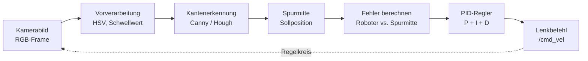
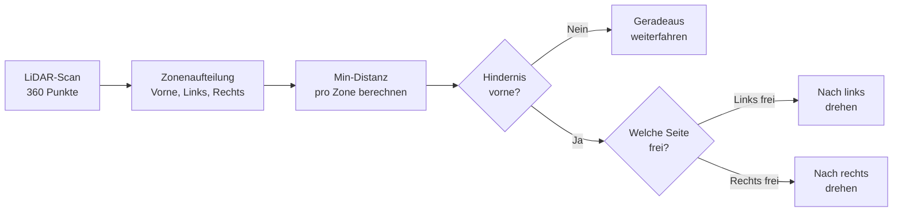
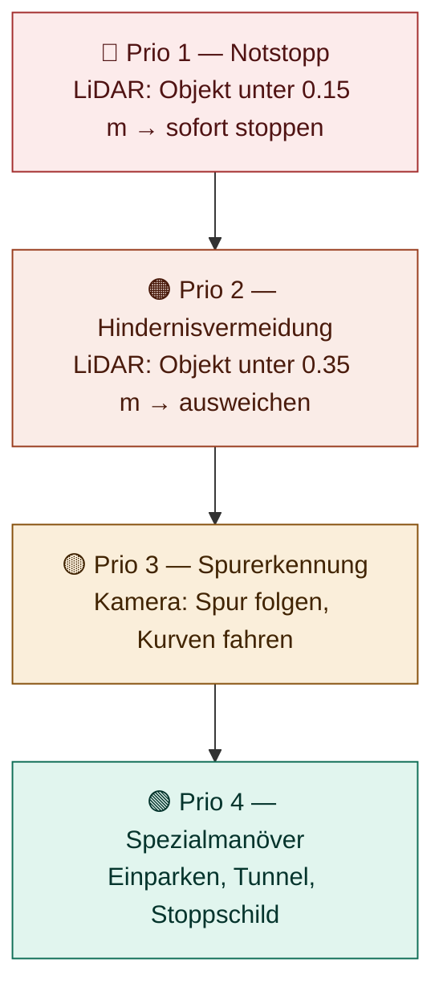
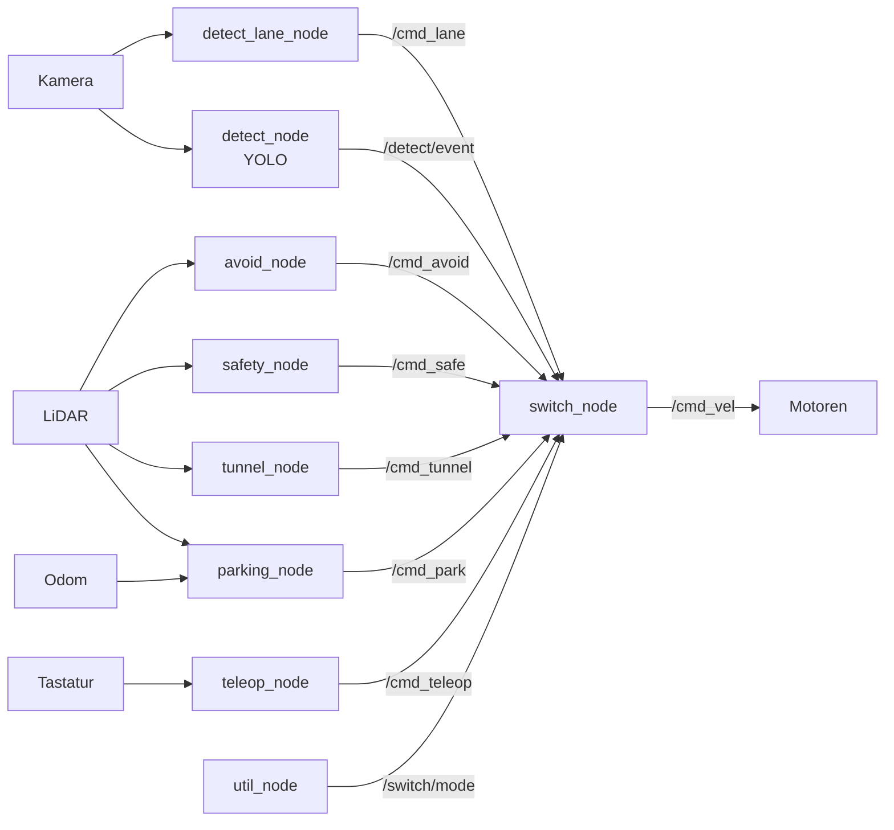

# URMC – Technisches Konzept

## Spurerkennung & Hindernisvermeidung

---

## 1. Sensoren des TurtleBot3 Burger

Der TurtleBot3 Burger hat vier Sensoren, die wir für den Wettbewerb nutzen.

### LiDAR (360°)

- **Reichweite:** 0.12 – 3.5 m
- **Abdeckung:** 360° Rundumsicht
- **ROS2-Topic:** `/scan`
- **Einsatz:** Hindernisvermeidung, Tunnelerkennung, Einparken, SLAM

Der LiDAR dreht sich kontinuierlich und liefert ca. 360 Entfernungsmessungen pro Umdrehung. Jeder Messpunkt gibt die Distanz zum nächsten Objekt in einer bestimmten Winkelrichtung an.

### Kamera (2D)

- **Sichtfeld:** ca. 62°
- **Richtung:** nach vorne
- **ROS2-Topic:** `/camera/image_raw`
- **Einsatz:** Spurerkennung, Schildererkennung (YOLO), visuelle Navigation

Die Kamera liefert ein Farbbild (RGB), das wir für Bildverarbeitung und neuronale Netze verwenden.

### Rad-Encoder (Odometrie)

- **ROS2-Topic:** `/odom`
- **Einsatz:** Positionsschätzung, Geschwindigkeitsmessung

Die Encoder an beiden Rädern messen die Drehung und berechnen daraus die zurückgelegte Strecke und aktuelle Position.

### IMU (9-Achsen)

- **ROS2-Topic:** `/imu`
- **Einsatz:** Orientierung, Drehrate, Beschleunigung

Der Inertialsensor liefert Lage- und Bewegungsdaten, die zusammen mit der Odometrie eine genauere Positionsschätzung ermöglichen.

---

## 2. Spurerkennung (Lane Following)

### Grundprinzip

Der Roboter muss sich auf einer markierten Fahrbahn halten — in Geraden und Kurven. Dazu nutzen wir die **Kamera** als Hauptsensor. Der Kern ist ein **klassischer Regelkreis**.

### Ablauf

### Schritt für Schritt

**Schritt 1 – Kamerabild aufnehmen:**
Das RGB-Bild wird vom `/camera/image_raw`-Topic gelesen. Typischerweise betrachten wir nur die untere Hälfte des Bildes (ROI), weil die Spurmarkierungen dort am relevantesten sind.

**Schritt 2 – Vorverarbeitung:**
Das Bild wird in den HSV-Farbraum konvertiert. Dort lassen sich Farben besser isolieren als in RGB. Mit Schwellwertfiltern erzeugen wir eine Binärmaske, die nur die Spurmarkierungen zeigt.

**Schritt 3 – Kantenerkennung:**
Auf der Binärmaske werden Kanten erkannt (Canny-Algorithmus) und Linien extrahiert (Hough-Transformation). Alternativ: Schwerpunktverfahren — der Mittelpunkt aller weißen Pixel in der Binärmaske.

**Schritt 4 – Spurmitte berechnen:**
Aus den erkannten Linien wird die Spurmitte berechnet — die Sollposition, der der Roboter folgen soll.

**Schritt 5 – Fehler berechnen:**
Die Abweichung zwischen der aktuellen Roboterposition (Bildmitte) und der Spurmitte ergibt den Fehler. Positiver Fehler = Roboter ist zu weit rechts, negativer = zu weit links.

**Schritt 6 – PID-Regler:**
Der Fehler wird durch einen PID-Regler verarbeitet:

- **P (Proportional):** Reagiert auf den aktuellen Fehler — je größer die Abweichung, desto stärker die Korrektur
- **I (Integral):** Kompensiert dauerhaft kleine Abweichungen, die sich über die Zeit aufbauen
- **D (Differenzial):** Reagiert auf die Änderungsrate des Fehlers — dämpft Überschwinger

**Schritt 7 – Lenkbefehl senden:**
Der PID-Ausgang wird als `angular.z` (Drehgeschwindigkeit) auf das `/cmd_vel`-Topic publiziert. Die Vorwärtsgeschwindigkeit `linear.x` wird konstant gehalten oder bei starken Kurven reduziert.

### Zwei Ansätze

| Ansatz | Methode | Vorteile | Nachteile |
|--------|---------|----------|-----------|
| **Klassisch (OpenCV)** | HSV-Filter → Canny → Hough → PID | Schnell, vorhersagbar, wenig Rechenleistung | Empfindlich bei Lichtwechsel |
| **Neuronal (YOLO/DNN)** | Kamerabild → Netz → Spurmitte direkt | Robust bei schwierigen Bedingungen | Braucht Training, mehr GPU-Last |

Unser Plan: Mit dem klassischen Ansatz starten (schnell einsatzbereit), YOLO als Backup vorbereiten.

---

## 3. Hindernisvermeidung (Obstacle Avoidance)

### Grundprinzip

Der Roboter muss Hindernisse erkennen und ihnen ausweichen, ohne die Fahrbahn zu verlassen. Dazu nutzen wir den **LiDAR** als Hauptsensor.

### Ablauf

### Schritt für Schritt

**Schritt 1 – LiDAR-Scan lesen:**
Das `/scan`-Topic liefert ein Array von Entfernungswerten. Jeder Index entspricht einem Winkel (0° = vorne, 90° = links, 270° = rechts, 180° = hinten).

**Schritt 2 – Zonenaufteilung:**
Wir teilen den 360°-Scan in logische Zonen auf:

- **Vorne:** -30° bis +30°
- **Links:** 30° bis 90°
- **Rechts:** 270° bis 330°
- **Hinten:** 150° bis 210°

**Schritt 3 – Minimale Distanz berechnen:**
Für jede Zone wird der kleinste gemessene Abstand ermittelt — der nächste Punkt eines Hindernisses in dieser Richtung.

**Schritt 4 – Entscheidungslogik:**

| Bedingung | Aktion |
|-----------|--------|
| Frontzone > 0.35 m | Geradeaus weiterfahren |
| Frontzone < 0.35 m, Links frei | Nach links drehen |
| Frontzone < 0.35 m, Rechts frei | Nach rechts drehen |
| Alles unter 0.35 m | Rückwärts und drehen |
| Irgendetwas unter 0.15 m | **Notstopp** |

### Drei Schwierigkeitsstufen

| Stufe | Algorithmus | Beschreibung |
|-------|-------------|-------------|
| **Einfach** | Zonenbasiert (reaktiv) | Wie oben beschrieben. Schnell, kein Speicher nötig, leicht zu debuggen |
| **Mittel** | VFH (Vector Field Histogram) | Erstellt ein Histogramm freier Richtungen und wählt die beste |
| **Fortgeschritten** | Nav2 Costmap + DWA Planner | Nutzt eine interne Karte mit Kosten pro Zelle und plant optimale Pfade |

Unser Plan: Muss noch festgelegt werden! -> ????Zonenbasierte Logik als Basis oder Nav2 Costmap + DWA Planner???.

---

## 4. Gesamtarchitektur — Subsumption

### Prioritätshierarchie

Das zentrale Designprinzip ist die **Subsumption-Architektur**: Mehrere Verhaltensschichten laufen parallel, aber eine klare Prioritätsreihenfolge bestimmt, welcher Befehl tatsächlich an die Motoren geht.

Höhere Priorität überschreibt niedrigere. Jede Schicht ist ein eigener ROS2-Node und kann unabhängig getestet werden.

### Wie es zusammenspielt

Im **Normalbetrieb** folgt der Roboter der Spur (Prio 3). Die Kamera erkennt die Fahrbahnmarkierungen und der PID-Regler lenkt den Roboter entlang der Spurmitte.

Sobald der **LiDAR ein Hindernis** unter 0.35 m erkennt, übernimmt die Hindernisvermeidung (Prio 2) und überschreibt den Spurfolge-Befehl. Der Roboter weicht aus.

Kommt etwas **gefährlich nah** (unter 0.15 m), greift der Notstopp (Prio 1) und der Roboter steht sofort still.

Für **Spezialmanöver** wie Einparken oder Tunnel wird Prio 4 aktiviert. Diese laufen nur, wenn kein höherpriorisiertes Verhalten aktiv ist.

---

## 5. Datenfluss im System

So fließen die Daten von den Sensoren über die Nodes bis zu den Motoren:

Der `switch_node` ist das Herzstück: Er empfängt die Fahrbefehle aller Nodes und leitet nur den richtigen an `/cmd_vel` weiter. Der `util_node` sagt ihm, welcher Modus gerade aktiv ist (Lane, Parking, Tunnel, Teleop). Safety und Avoid können den aktiven Modus jederzeit überstimmen.

---

## 6. Wettbewerbsdisziplinen → Module

| Disziplin | Hauptsensor | Algorithmus | Prio |
|-----------|-------------|-------------|------|
| Spurhalten (Gerade) | Kamera | HSV + PID | 3 |
| Spurhalten (Kurve) | Kamera | HSV + PID (angepasst) | 3 |
| Hindernisvermeidung | LiDAR | Zonenlogik | 2 |
| Einparken | LiDAR + Odom | Sequenz-Steuerung | 4 |
| Tunnel | LiDAR | Wandfolge-Algorithmus | 4 |
| Stoppschild / Schilder | Kamera (YOLO) | Objekterkennung | 4 |

---

## 7. Nächste Schritte

1. Docker-Container aufsetzen und Gazebo-Simulation starten
2. Spurerkennung mit OpenCV im Simulator implementieren und PID tunen
3. Hindernisvermeidung mit LiDAR-Zonenlogik implementieren
4. switch_node und util_node für die Prioritätssteuerung bauen
5. Spezialmanöver (Einparken, Tunnel) einzeln entwickeln
6. YOLO für Schildererkennung trainieren und integrieren
7. Alles zusammenführen und auf dem echten TurtleBot3 testen

---
---

*Notizen für die Vorbereitung auf die Upper Rhine Mobile Robotic Challenge (URMC) in Mulhouse.*
